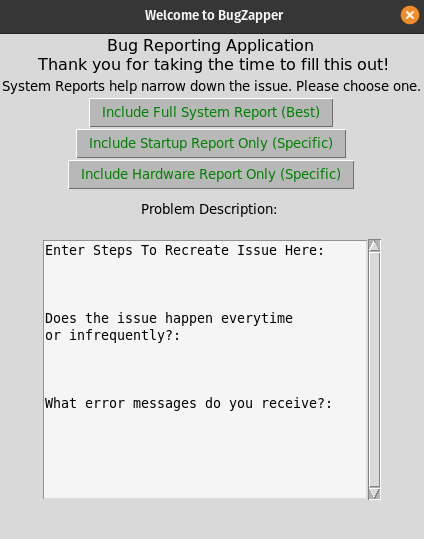

# bugzapper

Python tool for bug reporting and system report captures in Linux. Work in progress
Tool is a concept for bug reporting app to be included in Linux distros to accomplish the following:
1. Users to more easily produce bug reports. 
2. Provide more details to developers with inclusion of system reports
3. Unify bug reporting
Contributions welcome. Concept project only. 
